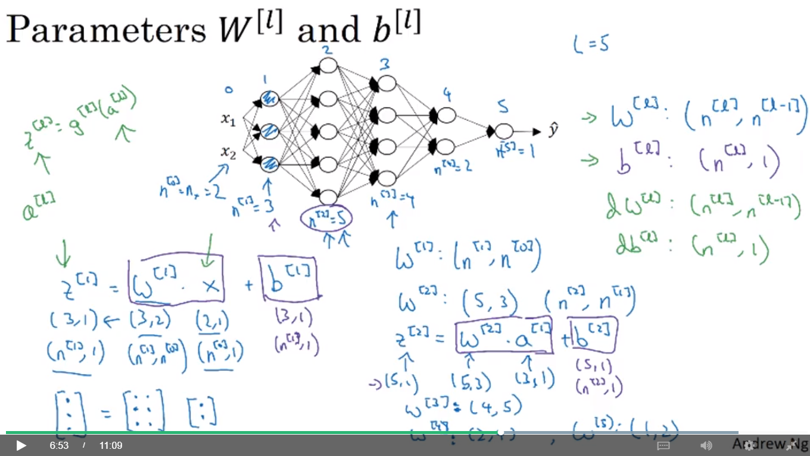

notes for deeplearning
====

1.loss function（损失函数）：
----

一个测试数据输入网络后，输出结果与真实值的差距

2.cost function(代价函数)：
----

整个测试集输入网络后，每一g个测试函数输出的损失函数的平均值

3.检查矩阵维度：
----

W[L]=(n(L),n(L-1))

b[L]=(n(L),1)

dW[L]=(n(L),n(L-1))

db[L]=(n(L),1)

Z[L]=(n(L),m)   (m为样本个数)

dZ[L]=(n(L),m)

训练集
----

这个是最好理解的，用来训练模型内参数的数据集，Classfier直接根据训练集来调整自身获得更好的分类效果

验证集   
----

用于在训练过程中检验模型的状态，收敛情况。验证集通常用于调整超参数，根据几组模型验证集上的表现决定哪组超参数拥有最好的性能。   

同时验证集在训练过程中还可以用来监控模型是否发生过拟合，一般来说验证集表现稳定后，若继续训练，训练集表现还会继续上升，但是验证集会出现不升反降的情况，这样一般就发生了过拟合。所以验证集也用来判断何时停止训练

测试集
----

测试集用来评价模型泛化能力，即之前模型使用验证集确定了超参数，使用训练集调整了参数，最后使用一个从没有见过的数据集来判断这个模型是否Work。

作者：Ph0en1x
链接：https://zhuanlan.zhihu.com/p/35394638
来源：知乎
著作权归作者所有。商业转载请联系作者获得授权，非商业转载请注明出处。
